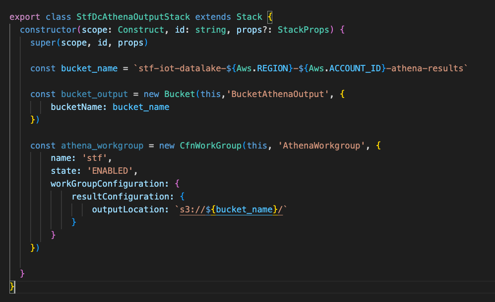
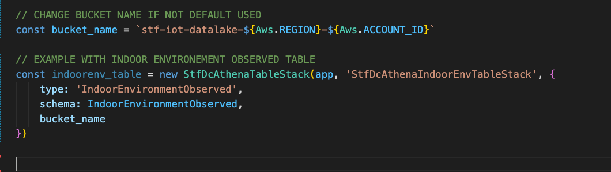
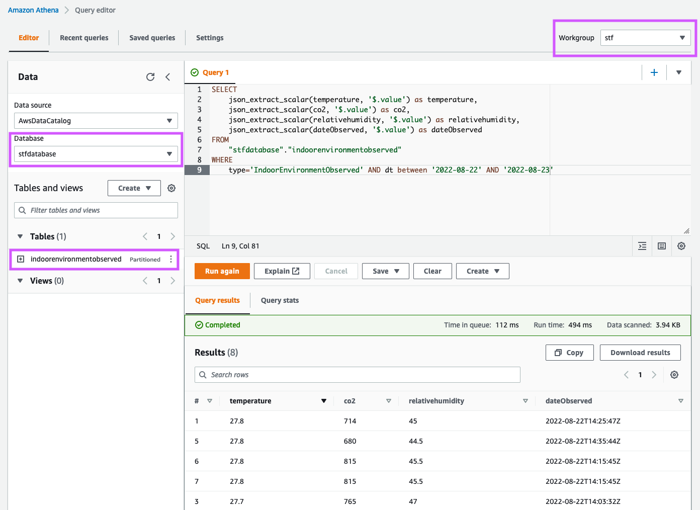

# Smart Territory Framework - Data Consumer using Amazon Athena

This repository contains a CDK application of a Data Consumer using [Amazon Athena](https://aws.amazon.com/athena). 

Amazon Athena is an interactive query service that makes it easy to analyze data in Amazon S3 using standard SQL. Athena is serverless, so there is no infrastructure to manage, and you pay only for the queries that you run.

Athena is easy to use. Simply point to your data in Amazon S3, define the schema, and start querying using standard SQL. Most results are delivered within seconds. With Athena, there’s no need for complex ETL jobs to prepare your data for analysis. This makes it easy for anyone with SQL skills to quickly analyze large-scale datasets.

This application shows you how you can create a [database and tables](https://docs.aws.amazon.com/athena/latest/ug/understanding-tables-databases-and-the-data-catalog.html) to query your STF IoT Datalake. We assume you have deployed the [STF Core](https://github.com/aws-samples/aws-stf-core-scorpio) before you deploy this application. 

## Prerequisites

<br>

To deploy this application, you need the following:
- An AWS account. If you don't have one, see [Set up an AWS account](https://docs.aws.amazon.com/greengrass/v2/developerguide/setting-up.html#set-up-aws-account).
- An AWS Identity and Access Management (IAM) user with administrator permissions
- AWS CDK Toolkit installed. See [Getting started with the AWS CDK](https://docs.aws.amazon.com/cdk/latest/guide/getting_started.html) to install it.
- [STF Core](https://github.com/aws-samples/aws-stf-core-scorpio) deployed. The following CDK application requires the bucket name of the STF IoT Datalake. If you have kept the default name, you don't need to change anything.  

<br>

## Getting started

This CDK application contains [three stacks](./bin/stf-dc-athena.ts) that enable you to easily query and analyze data in the STF IoT Datalake. 

- A stack that creates a [Workgroup](https://docs.aws.amazon.com/athena/latest/ug/manage-queries-control-costs-with-workgroups.html) for Athena that is named `stf`. A bucket named `stf-iot-datalake-${Aws.REGION}-${Aws.ACCOUNT_ID}-athena-results` that will be used as location for Athena query results. You can comment this stack if not needed. 

<br>



<br>


- A stack that creates a Database for Athena. You can set the name of the database in the file [parameters.ts](./parameters.ts) but we recommend we keep the default one: `stfdatabase`. If you have already created the database, you can comment it. 


- A stack to deploy a Table for Athena. This table is created using the schema defined in the file [schema.ts](./schema.ts). You can deploy this stack multiple times using different schemas. In this application, we create a table for entities of type [IndoorEnvironmentObserved](https://github.com/smart-data-models/dataModel.Environment/blob/master/IndoorEnvironmentObserved/README.md). Note that we use properties from the [AirQualityObserved](https://github.com/smart-data-models/dataModel.Environment/tree/master/AirQualityObserved) model. To deploy this stack, you must provide the type of your entities (as stored in the STF IoT Data Lake), the schema that contains the properties (see [schema.ts](./schema.ts)) and the name of the STF IoT Datalake bucket.


<br>



<br>

Once it is set up, you can deploy the application using the following commands: 

<br>

```
npm install
```

```
cdk bootstrap
```

```
cdk deploy --all
```

Voilà. You have everything ready. 

You can now build dashbords and applications that use Amazon Athena to get insights from your data. 
Below an example of how to query the datalake using Amazon Athena in the [AWS Console](https://console.aws.amazon.com/athena/home). 

<br>



<br>


## Additional Resources

This section provides links to additional resources that may help deploy and operate this application:

- [Smart Territory Framework Catalog](https://github.com/aws-samples/aws-stf)
- [Smart Territory Framework - Foundations for Smart Territories](https://youtu.be/4MRZiC1VvKQ)
- [Getting started with AWS IoT Core for LoRaWAN](https://www.youtube.com/watch?v=6-ZrdRjqdTk). 
- [STF Core](https://github.com/aws-samples/aws-stf-core-scorpio).
- [AWS CDK Workshop](https://cdkworkshop.com/)
- [JSON-LD, NGSI-LD, Digital Twins and Smart Data Models](https://www.youtube.com/watch?v=dfigPKx99Bs)

## Security

See [CONTRIBUTING](CONTRIBUTING.md#security-issue-notifications) for more information.

## License

This library is licensed under the MIT-0 License. See the LICENSE file.